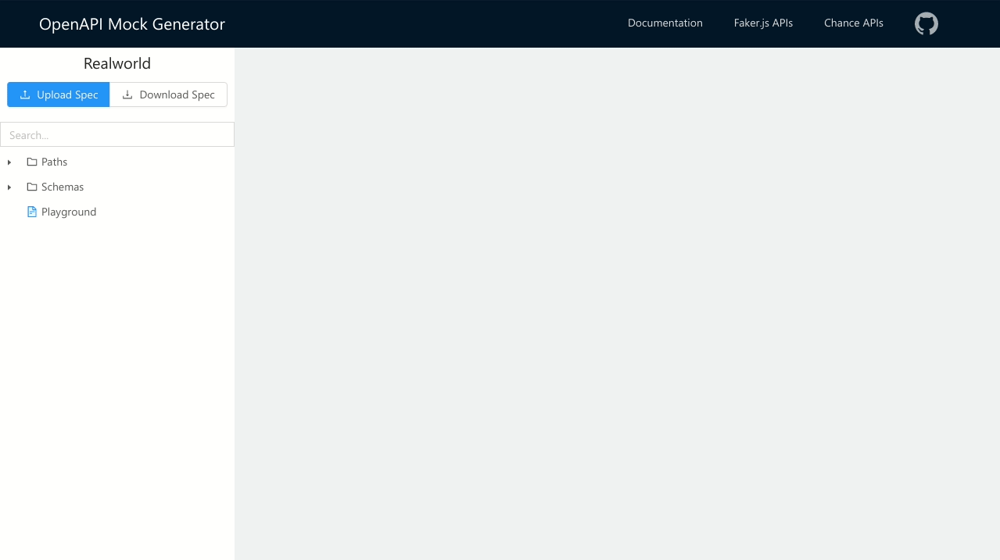

<div align="center">

# OpenAPI Mock Generator

Create realistic mocked data from an OpenAPI specification, using [faker.js](https://github.com/marak/Faker.js/) and [Chance](https://chancejs.com/) random data generators.

[![GitHub Workflow Status][build-shield]][build]
[![Cypress.io tests][cypress-shield]][cypress]
[![Codecov][coverage-shield]][coverage]
![GitHub release (latest SemVer)][version-shield]
![License][license-shield]

[Go to app](https://fredx87.github.io/openapi-mock-generator/)



</div>

## Features

- Support for OpenAPI 3.0 (and 2.0 with conversion to 3.0)
- Generate realistic mocks for paths/schemas using JSON Schema properties (like `format`. `minimum`, `maximum`, etc...), [faker.js](https://github.com/marak/Faker.js/) or [Chance](https://chancejs.com/) data generators.
- Autocomplete for OpenAPI properties, Faker.js methods, and Chance methods
- Multiple projects support with data stored locally in the browser
- Offline support

## Usage

Once you have loaded an OpenApi specification, you can navigate the tree with paths and schemas, and load a definition in the editor. You can modify the selected definition and see the generated mocked data in the editor on the right. The modified definition will be taken also by other elements that have a reference to that definition.

In the tree, there is also a special `Playground` item that can be used to generate data "on the fly" without modifying an existing definition.

### JSON Schema properties examples

Data can be generated from the `format` property:

```json
{
  "type": "object",
  "properties": {
    "date": {
      "type": "string",
      "format": "date-time"
    },
    "uuid": {
      "type": "string",
      "format": "uuid"
    }
  }
}
```

```json
{
  "date": "1986-09-22T16:44:15.119Z",
  "uuid": "daf0229f-cc3b-2b50-bbe4-6dea4837b0bf"
}
```

Number ranges can be controlled with `minimum` and `maximum`:

```json
{
  "type": "integer",
  "minimum": 10,
  "maximum": 42
}
```

```json
21
```

Array items length can be controlled with `minItems` and `maxItems`:

```json
{
  "type": "array",
  "minItems": 5,
  "maxItems": 10,
  "items": {
    "type": "number"
  }
}
```

```json
[
  71856238.93752578,
  -9957501.746244192,
  -7145041.207682312,
  -53358509.39871331,
  -83770088.68054512,
  -25448017.578881666,
  45764879.26211512,
  -5112859.453620076,
  -74878171.17192386,
  46948099.995764345
]
```

### Faker.js and Chance methods

You can use the name of a `faker.js` or `Chance` method using the `x-faker` or `x-chance` properties:

```json
{
  "type": "object",
  "properties": {
    "name": {
      "type": "string",
      "x-chance": "company"
    },
    "description": {
      "type": "string",
      "x-faker": "company.catchPhrase"
    }
  }
}
```

```json
{
  "name": "Citigroup, Inc",
  "description": "Vision-oriented foreground middleware"
}
```

You can pass parameters to the method using an object with the method name as a key and an array of values as parameters:

```json
{
  "type": "object",
  "properties": {
    "date": {
      "type": "string",
      "format": "date",
      "x-faker": {
        "date.between": ["2000", "2050"]
      }
    }
  }
}
```

```json
{
  "date": "2040-05-06"
}
```

You can pass also object as a single parameter:

```json
{
  "type": "object",
  "properties": {
    "email": {
      "type": "string",
      "format": "email",
      "x-chance": {
        "email": {
          "domain": "acme.com"
        }
      }
    }
  }
}
```

```json
{
  "email": "aci@acme.com"
}
```

For Faker.js, you can interpolate multiple results with the `fake` method:

```json
{
  "type": "object",
  "properties": {
    "name": {
      "type": "string",
      "x-faker": {
        "fake": ["{{name.lastName}}, {{name.firstName}} {{name.suffix}}"]
      }
    }
  }
}
```

```json
{
  "name": "Schmeler, Odie Jr."
}
```

The code generation is based on [json-schema-faker](https://github.com/json-schema-faker/json-schema-faker), you can also check the [project documentation](https://github.com/json-schema-faker/json-schema-faker/blob/master/docs/USAGE.md) for other examples.

## License

MIT

[build]: https://github.com/Fredx87/openapi-mock-generator/actions?query=workflow%3A%22Build+and+test%22
[build-shield]: https://img.shields.io/github/workflow/status/Fredx87/openapi-mock-generator/Build%20and%20test
[coverage]: https://codecov.io/gh/Fredx87/openapi-mock-generator
[coverage-shield]: https://img.shields.io/codecov/c/github/Fredx87/openapi-mock-generator
[version-shield]: https://img.shields.io/github/v/release/Fredx87/openapi-mock-generator
[license-shield]: https://img.shields.io/github/license/Fredx87/openapi-mock-generator
[cypress]: https://dashboard.cypress.io/projects/ebmx24/runs
[cypress-shield]: https://img.shields.io/badge/cypress.io-tests-green.svg
